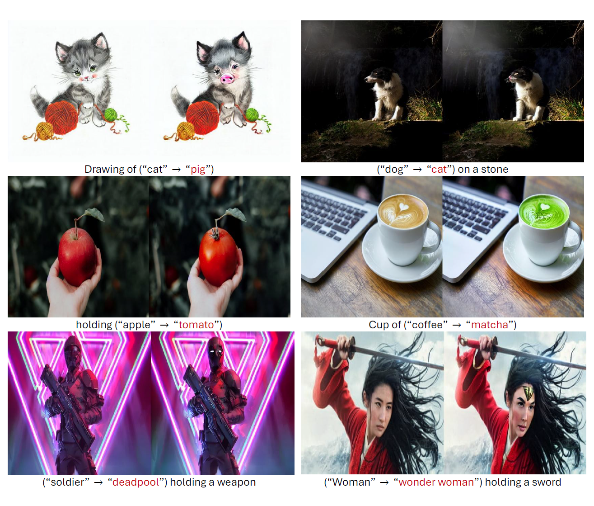
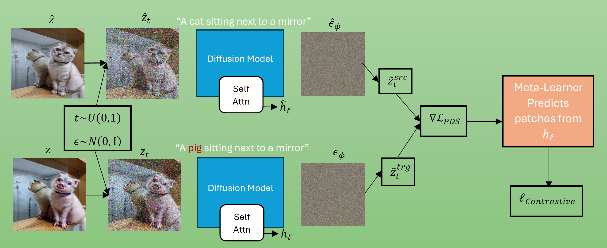

# Contrastive Posterior Distillation Sampling for Image Editing

Official pytorch implementation of CPDS.<br>

## Abstract
Text conditioned image editing transforms a given image and text prompt into a desired target prompt. Editing represents a significant challenge, requiring both faithful transformation according to a target prompt while preserving the source image’s
identity. We introduce Contrastive Posterior Distillation Sampling (CPDS), a novel method that combines structural consistency preservation from Contrastive Denoising
Score (CDS) with the identity-preserving optimization of Posterior Distillation Sampling (PDS). CPDS achieves superior results with up to 50% improvement in perceptual
similarity metrics while maintaining alignment with target text prompts. We further enhance CPDS by replacing random patch selection used to compute the contrastive
loss with a Meta-Learner network that predicts which feature patches to preserve, improving structural correspondence without increasing inference time. Our approach
demonstrates significant qualitative and quantitative improvements over existing state-of-the-art methods across multiple image editing tasks.

<p align="center">
  
</p>

## Overview

CPDS incorporates the CUT loss from CDS into the PDS framework, achieving significantly better balance between preserving structural details and text alignment.
By combining these complementary approaches, CPDS achieves both trajectory alignment through PDS and spatial correspondence through the CUT loss.
A limitation of the CUT loss in both CDS and our CPDS method is its reliance on random patch selection, which can sometimes lead to suboptimal structural correspondence.
To address this, we introduce a Meta-Learner network that replaces random patch selection with predicted patches, improving perceptual similarity while maintaining inference efficiency.





## Setup
### Requirements
```shell
conda install pytorch==2.1.1 torchvision==0.16.1 torchaudio==2.1.1 pytorch-cuda=11.8 -c pytorch -c nvidia 
pip install diffusers==0.16.1 
pip install transformers==4.32.1 
```

### Usage
```bash
python run.py --img_path sample/soldier.jpg --prompt "soldier holding a weapon" --trg_prompt "deadpool holding a weapon" --patch_size 1 2 --n_patches 256
```

## Acknowledgments
This code builds upon the original CDS repository at:
[CDS repo](https://github.com/HyelinNAM/ContrastiveDenoisingScore)

Elements are incorporated from the PDS repository at:
[PDS repo](https://github.com/KAIST-Visual-AI-Group/PDS)
